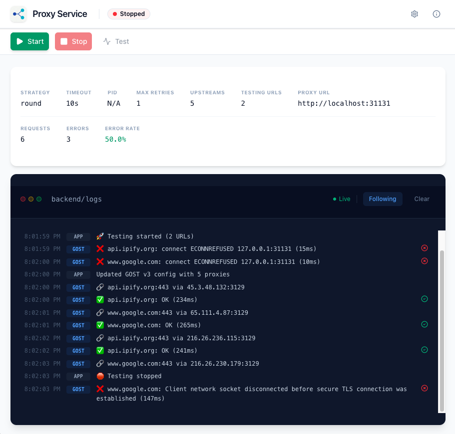
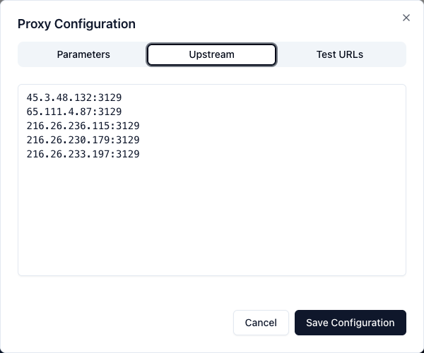

# GOST Proxy Wrapper

[](https://choosealicense.com/licenses/mit/)
[](https://github.com/go-gost/gost)
[](https://www.docker.com/)

A simple **Web UI wrapper** for the [GOST](https://github.com/go-gost/gost) proxy tunnel. It provides a convenient way to manage upstream proxies and monitor rotation logs through a built-in dashboard.

Built with [@mchen-lab/app-kit](https://github.com/mchen-lab/app-kit).

## Quick Start

```bash
docker run -d \
  --name gost-proxy-service \
  -p 31130:31130 \
  -p 31131:31131 \
  -v gost_proxy_service_data:/app/data \
  ghcr.io/mchen-lab/gost-proxy-service:latest
```

Navigate to [http://localhost:31130](http://localhost:31130) to access the UI.

## Screenshots

### Dashboard


### Configuration


## Usage

1. **Open the Web UI**: Navigate to `http://localhost:31130`
2. **Add Proxies**: Click Settings → Upstream tab → Add your proxies (one per line)
3. **Connect**: Point your applications to `localhost:31131` as their proxy.
4. **Monitor**: Watch the logs to see GOST activity and rotation status.

## Ports

| Port | Purpose |
|------|---------|
| **31130** | Web UI + API |
| **31131** | Proxy entry point (use this in your apps) |
| **31132** | Internal GOST API |

## Configuration

### Environment Variables

| Variable | Default | Description |
|----------|---------|-------------|
| `PORT` | 31130 | Web UI/API port |
| `GOST_PROXY_URL` | http://127.0.0.1:31131 | Proxy endpoint |
| `GOST_API_URL` | http://127.0.0.1:31132 | GOST API endpoint |
| `GOST_BINARY_PATH` | /usr/local/bin/gost | Path to GOST binary |

### Persistence

Mount a volume to persist your proxy configuration:

```bash
-v gost_proxy_data:/app/data
```

## Security Warning & Best Practices

> [!IMPORTANT]
> This tool is designed for **Local Development and Study Use Only**.

- **No Authentication**: The proxy entry point and Web UI do not have built-in authentication.
- **Local Access Only**: It is strongly recommended to run this service only on `localhost` or within a secure, private network.
- **Exposure Risk**: Do NOT expose the ports (31130, 31131, 31132) to the public internet, as anyone with the IP could use your proxy or modify settings.

### How do I update to the latest version?

Run the following command:

```bash
docker pull ghcr.io/mchen-lab/gost-proxy-service:latest && \
docker stop gost-proxy-service && \
docker rm gost-proxy-service && \
docker run -d \
  --name gost-proxy-service \
  -p 31130:31130 \
  -p 31131:31131 \
  -v gost_proxy_service_data:/app/data \
  ghcr.io/mchen-lab/gost-proxy-service:latest
```

#### Using Docker Compose

If you are using Docker Compose, you can update to the latest version by running:

```bash
docker compose pull && docker compose up -d
```


## Disclaimer

This project is for educational and development purposes only. The author(s) are not responsible for any misuse, illegal activities, or damages caused by the use of this software. Users are responsible for complying with their local laws and the terms of service of any third-party providers.

## License

MIT
